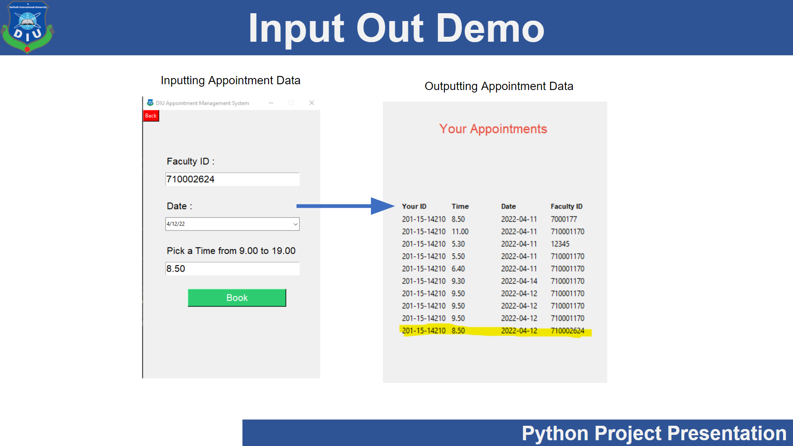

# appointment_management_desktop_application

## Dependency of this project
```pip install pillow```

```pip install tkcalendar```

Download [sqlite browser for create database](https://sqlitebrowser.org/dl/)

# Project OverView





